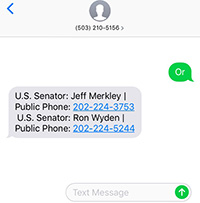

# MyRep: Text to get your Senators Phone Number

## What?

Send an SMS with any two-character USPS state abbreviation to (503) 210-5156. MyRep will return your two senators and their public DC office phone numbers. All data is supplied by the [ProPublica Congress API](https://projects.propublica.org/api-docs/congress-api/)

### For example

;

## Why?

Democracy works when our representatives represent us. You're already on your phone, so why not let your senator know how you feel about the issues.

## Notes

This app is a prototype and offers minimal input validation. It also has no tests or docs. Additionally, the dist/app.js file is hand tuned to accommodate the lack of a deployment strategy for Twilio Functions. This project is really meant as a prototype and learning exercise.

- **This idea could be expanded to:**
  - Parse a full street address and return all representatives
  - Implement NLP for a better conversational UX
  - Return other information, such as elected officials' voting records
